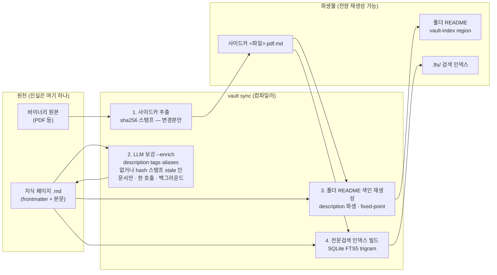
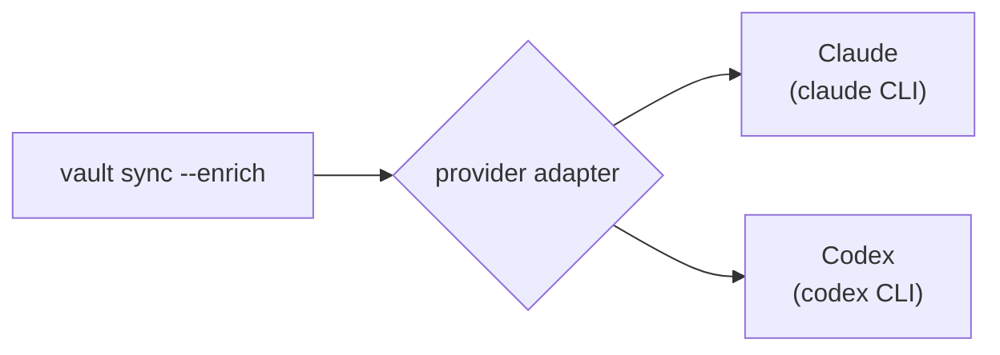
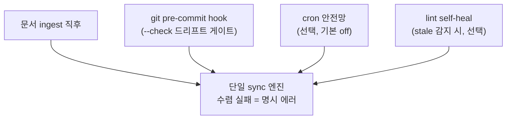
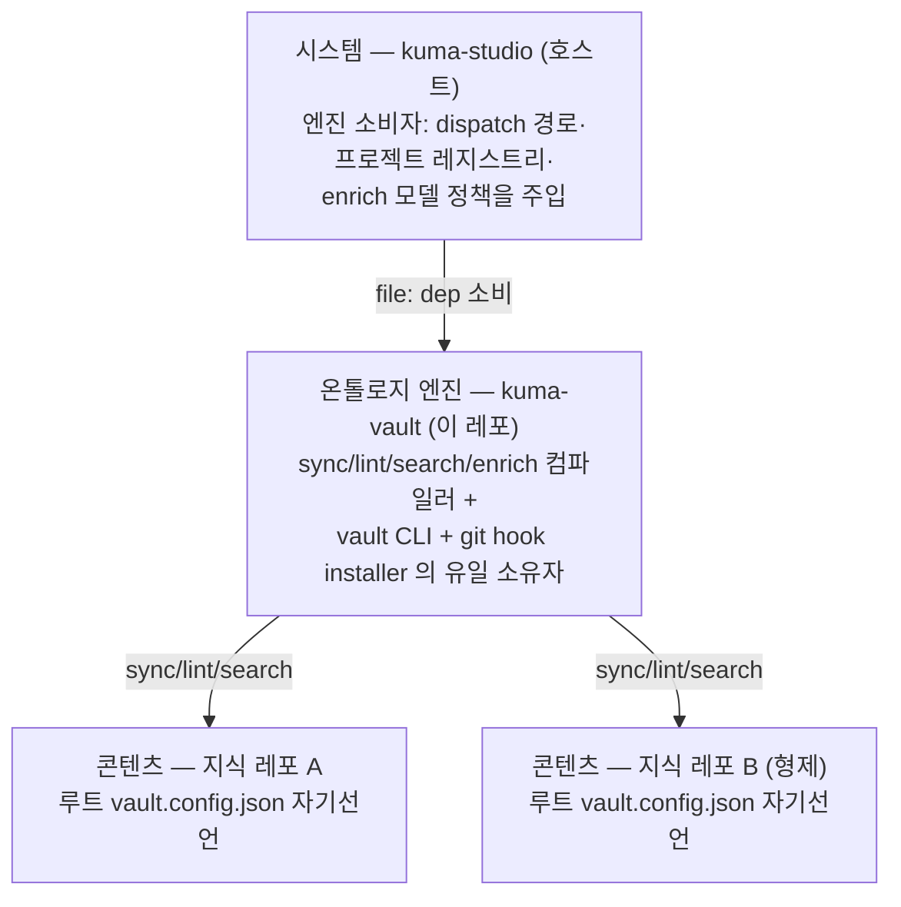

# Kuma Topology Vault — 아키텍처

> 마크다운 지식베이스를 **코드처럼 컴파일**하는 topology-first 지식 시스템. 이 문서는 배포판(스킬/플러그인)에 동봉되는 아키텍처 설명서다.

## 무엇이 문제인가

LLM 과 함께 쓰는 지식베이스는 보통 둘 중 하나로 무너진다.

1. **중앙 색인 방식** — 색인 문서를 손(또는 LLM)으로 유지하다 실제 파일과 어긋난다. 색인과 파일이 서로 다른 말을 하는 순간 검색도 신뢰도 무너진다.
2. **벡터 덤프 방식** — 문서를 청크로 갈아 임베딩에 넣으면 검색은 되지만, "이 지식의 주인이 어디인가"가 사라져 갱신·소유·정리가 불가능해진다.

공통 원인은 하나다: **진실이 두 곳에 살게 되는 것.**

## 핵심 원리 — 뷰는 전부 원천의 순수 함수

Kuma Topology Vault 는 사람/LLM 이 관리하는 지점을 **원천 문서 하나**로 고정한다. 폴더 색인·바이너리 요약·검색 인덱스는 전부 `vault sync` 한 방이 원천에서 **파생**하는 산출물이다. 파생은 content-hash 로 멱등 — 원천이 안 바뀌면 몇 번을 돌려도 no-op 이다. 그래서 색인 드리프트(draft)가 **원리적으로 생길 수 없다**.



## 토폴로지 — 소유권이 진실을 결정한다

폴더 트리가 곧 지식의 소유권 지도다. 모든 지식은 정확히 한 폴더(canonical owner)에 살고, 각 폴더의 `README.md` 가 진입점 겸 색인이다. 태그·별칭·frontmatter 는 검색 손잡이일 뿐 — **토폴로지가 진실을 정하고, 태그는 찾는 걸 도울 뿐이다.**

- **원천/증거 co-location**: 원본·첨부·중간 산출물은 주인 페이지 곁의 `_sources/`·`_evidence/`·`_assets/` 에 둔다 (non-nav — 색인·검색 대상 아님).
- **색인은 파생**: 폴더 README 의 `<!-- vault-index -->` 영역은 자식 문서의 frontmatter `description` 에서 자동 생성된다. 손으로 안 고친다.

## LLM 은 언제, 어디에 개입하나 — 백그라운드 보강

이 시스템에서 LLM 의 쓰기 권한은 **단 한 겹**이다: 문서 frontmatter 의 검색 메타데이터 세 칸 — `description` (한 줄 시놉시스) · `tags` (주제 태그) · `aliases` (동의어·약어·교차언어 검색어) — 과 그 옆의 idempotency 스탬프 `description_hash`·`tags_hash`·`aliases_hash`. 세 칸은 **한 번의 모델 호출**로 함께 생성된다 (호출 수는 description 만 채우던 때와 동일).

동작 방식:

1. 문서가 새로 들어오거나 **내용이 바뀌면**, 다음 경계(아래 트리거)에서 `vault sync --enrich` 가 백그라운드로 돈다.
2. enrich 는 세 칸 중 하나라도 비었거나 본문 hash 가 그 칸의 스탬프와 어긋난(=내용이 바뀐) 문서**만** 골라 LLM 을 한 번 호출해 description·tags·aliases 를 함께 받는다. 세 칸이 모두 최신인 문서는 모델 호출 자체가 없다.
3. 생성된 description 은 색인 라인과 검색 인덱스로, tags·aliases 는 검색 인덱스로 **파생**되어 흘러간다 — LLM 이 색인을 직접 쓰는 일은 없다.
4. 사람이 직접 쓴 값(스탬프 없는 description·tags·aliases)은 **칸별로 절대 덮어쓰지 않는다.** 이미 description 스탬프가 있는 문서에 tags·aliases 만 새로 채울 때도 description 은 재생성하지 않는다 (증분 보강). 새 tags 는 트리의 기존 태그 풀을 우선 재사용하되, 맞는 게 없으면 새로 만들고 그 근거를 페이지별로 기록한다 (bounded-vocab).
5. 모델 호출 실패는 파일을 건드리지 않고 명시 리포트로 남는다 — 조용한 대체 경로 없음.

`--enrich` 없이 도는 `vault sync` 는 모델을 전혀 부르지 않는다. 색인·검색·사이드카 파생은 전부 순수 함수라 오프라인·무비용이고, LLM 보강은 그 위에 얹히는 **선택적 한 겹**이다.

**Provider 는 꽂는 것** — 보강 모델은 어댑터로 주입된다. 순수 enrich 엔진은 주입된 `generateDescription({ relativePath, title, body, tagPool }) => { description, tags, aliases }` 하나만 요구하고 (프롬프트에 기존 태그 풀 `tagPool` 을 실어 재사용을 유도한다), 그걸 어떤 provider 로 채울지는 어댑터가 정한다. 어댑터는 provider CLI 를 **호출당 빈 임시 디렉토리**에서 한 번씩 스폰한다 — 대상 repo 안이 아니라서 프로젝트 지시·미커밋 작업을 못 보고, 딱 그 페이지의 요약만 낸다. 설치 시 선택지에서 provider 를 고른다:



지원 provider 목록은 어댑터가 **자체 보유**한다(외부 registry 의존 없음). 선택한 `{provider, model}` 은 엔진 설정에 영속되고, `--enrich` 는 그 설정으로 어댑터를 구성한다. 설정이 없으면 조용히 기본값으로 넘어가지 않고 **명시 에러**를 낸다.

## 경계 트리거 — 워처 데몬 없이

파일워처를 상주시키지 않는다. 잘 정의된 경계 네 곳이 **같은 sync 엔진 하나**를 호출한다:



경계마다 색인을 따로 만드는 재생성기는 없다 — 전부 하나의 `syncVaultIndex` 로 깔때기처럼 모인다. 그래서 어느 경계로 들어오든 결과가 같다. 수렴에 실패하면 self-heal 이 남은 드리프트를 삼키지 않고 **에러로 드러낸다.**

`--check` 는 **커밋에 들어가는 트리**에 대한 게이트다. 파생물을 사는 곳으로 나눠서 다르게 다룬다:

- **추적 파생물**(폴더 README 의 vault-index 영역, 바이너리 사이드카)은 커밋 안에 있다. 어긋났다는 건 커밋이 담을 스냅샷이 자기 생성기와 모순된다는 뜻이고, 커밋 도중 재생성해봐야 스테이지되지 않은 파일만 고쳐 스냅샷은 그대로 어긋난다 → exit 1, 사람이 `vault sync` 후 재커밋.
- **캐시 파생물**(`.fts/` 검색 인덱스)은 커밋 밖에 있다. 낡았다는 건 트리에 대한 사실이 아니라 캐시에 대한 사실이라 커밋의 정합성과 무관하다 → 원칙 1 의 self-heal 조항대로 라이브 트리에서 재빌드하고 통과시킨다. 재빌드는 로그로 드러나고(원칙 6), 실패하면 조용히 넘어가지 않고 에러가 된다.

이 구분이 없던 시절엔 다른 세션이 페이지 하나 고칠 때마다 FTS 서명이 밀려서, 자기 변경이 멀쩡한 세션의 커밋이 막혔다(2026-07-31 3회 실측). 캐시 미스는 사람을 부를 일이 아니라 스스로 복구할 일이다.

## 검색 — 흐린 질문이 파일까지 가는 길


- 검색 엔진 선택은 항상 출력에 노출된다: `engine: fts (auto)` / `engine: scan (query-below-trigram-min)` / `engine: scan (fts-index-absent)` — 무언 폴백 없음.
- 인덱스가 없으면 scan 으로 자가복구하고, 그 사실을 `engine` 필드로 알린다.
- FTS 인덱스는 원천 마크다운의 **순수 파생 캐시**다(SQLite FTS5, trigram tokenizer — ASCII·CJK substring recall 이 선형 scan 과 동치). 캐시 miss 는 곧바로 live 트리 scan 으로 복구된다.
- 검색 corpus 에서 **휘발성 슬롯(작업 계획·기계 이벤트 로그 같은 append-only 슬롯)은 제외**된다 — 그래야 "지식이 안 바뀌면 인덱스도 안 바뀐다"는 멱등 불변식이 살아있는 시스템에서도 성립한다.

## 4도메인 토폴로지 — 시스템 · 엔진 · 콘텐츠

볼트 생태계는 역할이 다른 네 레포(도메인)로 분리된다. 엔진은 어떤 트리도 하드코딩하지 않고, 각 지식 트리는 자기 계약을 스스로 선언한다:



- **온톨로지 엔진 (kuma-vault, 이 레포)** — 온톨로지 계약과 컴파일러의 유일한 소유자. `vault` CLI 와 git pre-commit hook installer 도 여기 산다.
- **시스템 (kuma-studio)** — 엔진의 소비자(호스트). 호스트 관심사(dispatch 경로·프로젝트 레지스트리·enrich 모델 정책)를 주입할 뿐 엔진 코드를 소유하지 않는다.
- **콘텐츠 (지식 레포 N, 형제)** — 실제 지식 트리들. 서로 물리 중첩 없이 형제로 존재하며 같은 온톨로지의 지배를 받는다. 트리마다 다른 것(색인 범위·검증 규칙·사이드카/enrich/FTS 토글)은 전부 그 트리 루트의 자기선언으로 표현된다.

트리 하나에 전용 포크를 두지 않는다 — 같은 sync/lint/search 엔진이 모든 트리를 섬기므로, 엔진 개선이 모든 트리에 동시에 닿는다.

## 레포 자기선언 — `vault.config.json` 이 계약을 소유한다

관리되는 트리는 루트에 `vault.config.json` 을 두고 **자기 계약을 스스로 선언**한다. 선언 = base 계약 id(`profile` — 엔진 빌트인 프로파일) + 트리 로컬 오버라이드(non-nav 루트 파일 추가, schema 경로, 기능 토글 등) + 선택 라벨 `id`:

```json
{ "profile": "kuma-vault" }
```

계약(profile)은 순수 데이터 객체다 — 어떤 슬롯이 non-nav 인지, 어떤 루트 파일이 ledger 인지, 사이드카/enrich/FTS 를 켤지 끌지를 선언한다. 한 선언은 바이너리 사이드카·LLM 보강·FTS 를 모두 켠 풀 파이프라인이 되고, 다른 선언은 git 으로 추적되는 topology 만 검증하는 pre-commit 게이트 전용이 된다.

CLI 는 이 선언에서 **root 와 계약을 한 번에** 해소한다. root 와 profile 을 손으로 짝지을 일이 없으므로, "`--profile` 만 주고 `--root` 를 빠뜨려 엉뚱한 트리에 남의 계약이 적용되는" 플래그-쌍 사고 클래스가 구조적으로 제거된다.

해소 계약 (fail-loud, No Silent Fallback):

- **선언이 계약을 소유한다.** 선언과 어긋나는 `--profile` 플래그는 hard error 다 — "플래그가 이긴다"는 없다 (선언 id 와 같은 값은 허용).
- **선언 없는 명시 root** 는 명시 `--profile` 을 요구한다(미선언 generic 트리 호환). 둘 다 없으면 hard error.
- **root 플래그가 없으면** cwd 에서 걸어 올라가며 선언을 탐색한다(탐색은 git toplevel 에서 바운드 — 지금 있는 레포 밖의 선언은 결코 적용되지 않는다). 못 찾으면 hard error — sync/lint 에 기본 볼트 fallback 은 없다.
- **깨진 선언 파일**(JSON 오류·모르는 키·타입 위반)은 건너뛰지 않고 throw 한다.

구현: `src/engine/vault-config.mjs` (`loadVaultDeclaration` / `discoverVaultDeclaration` / `resolveDeclaredProfile` / `resolveVaultContract`).

## 불변식 요약

| # | 불변식 | 집행 방식 |
|---|---|---|
| 1 | 모든 뷰는 원천의 순수 함수 | sync 파이프라인이 유일한 파생 경로 |
| 2 | LLM 유일 쓰기 지점 = frontmatter description | write-allowlist 테스트 (그 외 경로 변경 시 실패) |
| 3 | 파생은 hash 멱등 — 2회차는 no-op | sha256 / description_hash / corpus signature |
| 4 | 검증기(lint)와 생성기는 같은 규칙을 공유 | 공용 predicate 모듈 (계약 모순 구조적 불가) |
| 5 | 실패는 명시 리포트 — 무언 폴백 금지 | per-file 실패 목록, 수렴 실패 throw, engine 노출 |
| 6 | 휘발성 슬롯은 파생·검색 대상에서 제외 | corpus/색인 walk 공용 제외 규칙 |

## 설치하면 생기는 것

- `vault sync [--check] [--enrich]` / `vault lint` / `vault search` CLI
- git pre-commit 드리프트 게이트 (`vault hook install`)
- 에이전트용 스킬 (검색 프로토콜: search → timeline → get, 원천 재확인 원칙)
- 설치 시 인터랙티브 셋업: 보강 provider(Claude/Codex) 선택
