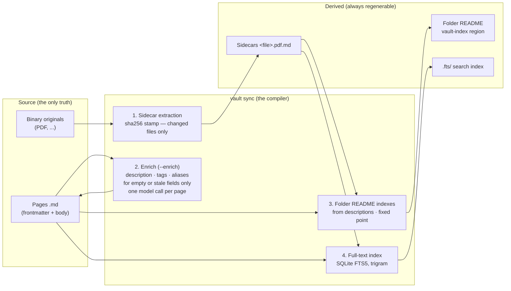
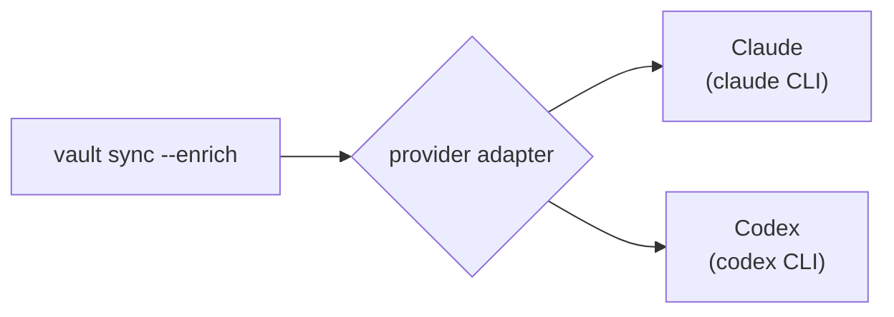
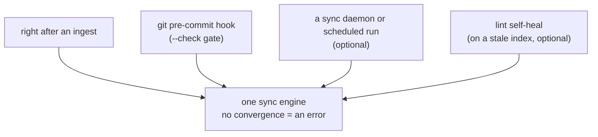
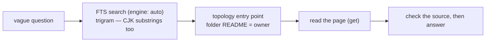
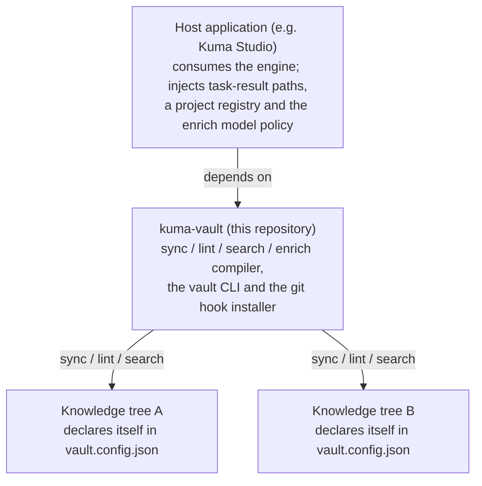

# Architecture

kuma-vault compiles a Markdown knowledge base the way a build tool compiles code. This page
explains the model: what is source, what is derived, where a model is allowed to write, and
how a tree declares its own rules.

## The problem

A knowledge base kept with an LLM usually decays in one of two ways:

1. **A hand-kept central index** drifts from the files. Once the index and the files disagree,
   neither search nor trust survives.
2. **A vector dump** chops documents into embedded chunks. Search works, but nobody knows which
   page owns a fact any more, so nothing can be updated, owned or tidied.

The common cause is one: **the truth lives in two places.**

## Every view is a pure function of the source

People and agents maintain one thing: the source pages. Folder indexes, binary-file sidecars
and the search index are all **derived** by one `vault sync`. Derivation is content-hash
idempotent — when the source has not changed, running it again changes nothing — so an index
cannot drift from its pages.



## The folder tree is the ownership map

Every piece of knowledge lives in exactly one folder, its canonical owner, and each folder's
`README.md` is both its entry point and its index. Tags, aliases and other frontmatter are
search handles only: **the topology decides what is true; tags help you find it.**

- **Sources sit next to their owner.** Originals, attachments and intermediate files go in
  `_sources/`, `_evidence/` and `_assets/` beside the owning page. These folders are not
  navigation and are not indexed.
- **Indexes are derived.** A folder README's `<!-- vault-index -->` region is generated from
  its children's frontmatter `description`. Nobody edits it by hand.

## Where a model may write — enrich

A model writes in exactly one place: three search fields in a page's frontmatter —
`description` (a one-line synopsis), `tags` (topic tags) and `aliases` (synonyms,
abbreviations, other-language search terms) — plus their idempotency stamps
`description_hash`, `tags_hash` and `aliases_hash`. One model call fills all three.

1. When a page is new or its body changes, the next `vault sync --enrich` picks it up.
2. Only pages with an empty field, or a field whose stamp no longer matches the body hash, get
   a call. A page whose three fields are current costs nothing.
3. The description flows into the folder index and the search index, tags and aliases into
   the search index — always by derivation. The model never writes an index.
4. A value a person wrote (a field with no stamp) is never overwritten, field by field.
   Filling only tags and aliases on a page whose description is already stamped does not
   regenerate the description. New tags reuse the tree's existing tag pool first; a new tag
   is allowed when none fits.
5. A failed call leaves the file untouched and is reported per file. There is no fallback.

`vault sync` without `--enrich` calls no model at all: sidecars, indexes and search are pure
functions, offline and free. Enrich is an optional layer on top.

**The provider is plugged in.** The pure enrich engine needs one injected function,
`generateDescription({ relativePath, title, body, tagPool }) => { description, tags, aliases }`.
An adapter supplies it by spawning the chosen CLI once per page in an **empty temporary
directory** — never inside the vault — so the model sees that page and nothing else: no
project instructions, no uncommitted work.



The adapter owns the list of supported providers. The chosen `{ provider, model }` is stored
by [`kuma-vault setup`](setup.md#enrich-provider); with no choice stored, `--enrich` is an
error, not a quiet default.

## When sync runs — boundaries, not a watcher

The compiler runs at well-defined boundaries, and every boundary calls the same sync engine:



No boundary has its own regenerator; they all funnel into `syncVaultIndex`, so the result is
the same whichever way you came in. If a run cannot converge, the leftover drift is reported
as an error. (On a server-backed vault the [sync daemon](sync.md) also runs `vault sync`
before each autosave commit.)

### What happens when a file changes

| Event | Who handles it | What happens |
|---|---|---|
| **Page added** | script, plus one model call with `--enrich` | the next sync lists it in its folder index; enrich fills `description`, `tags` and `aliases` in one call and stamps each field, so a rerun makes no call |
| **Page body changed** | script, plus one model call with `--enrich` | the body hash no longer matches a field's stamp, so only that page is enriched again; person-written fields are kept |
| **Page moved** | script only | the search fields travel with the file's frontmatter; the next sync removes it from the old folder's index and adds it to the new one. No model call |
| **Page deleted** | script only | its index line and search entry go. No model call |
| **Folder created** | script only | a folder holding pages gets a generated `README.md` and an entry in its parent's index; the chain converges within one sync |
| **Binary added or changed** (PDF, ...) | script plus extractor | only files whose sha256 changed get their sidecar (`<file>.pdf.md`) extracted again; sidecars are indexed and searched like pages |
| **Binary deleted** | script, report only | the leftover sidecar is reported as an orphan, never deleted silently; a person decides |
| **Model call failed** | explicit report | the file is untouched and listed among the per-file failures |

## The commit gate

`vault sync --check` is a gate on **the tree being committed**. It treats derived files by
where they live:

- **Tracked derived files** (the folder README `vault-index` regions, binary sidecars) are
  inside the commit. If they disagree with their generator, the snapshot being committed
  contradicts itself, and regenerating during the commit would only fix unstaged files → exit
  1; run `vault sync` and commit again.
- **The cache** (the `.fts/` search index) is outside the commit. A stale cache says nothing
  about the commit, so the gate rebuilds it from the live tree and passes, reporting
  `fts: healed`. A failed rebuild is an error.

Without this split, every edit another session made to some page would shift the search
index signature and block a commit that was itself correct. A cache miss is something to heal,
not something to call a person about.

On a server-backed store the gate also refuses commits during a freeze, binaries in
`binaries.reject` places and oversized non-LFS files, and builds no local `.fts/` — see
[remote mode](remote-mode.md#the-commit-gate-vault-sync---check-the-pre-commit-hook).

## Search — from a vague question to the right file



- The engine used is always printed: `engine: fts (auto)`, `engine: scan
  (query-below-trigram-min)`, `engine: scan (fts-index-absent)`. Nothing switches silently.
- Without an index, search scans the live tree and says so in the `engine` field.
- The FTS index is a pure cache of the Markdown (SQLite FTS5, trigram tokenizer), so its
  substring recall for ASCII and CJK equals a linear scan.
- **Volatile slots** — work plans and append-only machine logs — are left out of the search
  corpus, so "the index changes only when knowledge changes" holds even in a busy vault.

## Engine, host and content trees

The engine is one of three separate roles, and it hard-codes no tree:



- **The engine** is the only owner of the contract and the compiler, the `vault` CLI and the
  pre-commit hook installer.
- **A host** consumes the engine and injects its own concerns ([design](design.md)); it owns
  no engine code.
- **Knowledge trees** are siblings, never nested, all governed by the same engine. What
  differs per tree — index scope, checks, sidecar / enrich / FTS switches — is declared at
  that tree's root.

No tree gets a fork of the engine; an engine improvement reaches every tree at once.

## Trees declare themselves — `vault.config.json`

A managed tree carries a `vault.config.json` at its root that **declares its own contract**:
a base contract id (`profile`, one of the engine's built-in profiles), tree-local overrides
(extra non-navigation root files, the schema path, feature switches) and an optional `id`:

```json
{ "profile": "kuma-vault" }
```

Decisions that need the tree's own names live there too. For example, persona-memory pages at
the top of `domains/` are listed by the tree, `"personaMemoryPages": ["domains/<name>.md", …]`
(no default — a page's shape cannot tell a persona page from a misplaced topic page). An
undeclared top-level page is `domain-top-level-drift`.

A profile is plain data: which slots are not navigation, which root files are ledgers, whether
sidecars, enrich and FTS are on. One declaration gives the full pipeline; another gives only a
pre-commit gate that checks the git-tracked topology.

The CLI resolves **root and contract together** from this declaration, so a root can never be
paired with someone else's contract by a forgotten flag. The rules fail loudly:

- **The declaration owns the contract.** A `--profile` flag that disagrees with it is an
  error (the declared id itself is accepted).
- **An explicit root without a declaration** needs an explicit `--profile`; with neither, it
  is an error.
- **Without a root flag** the CLI walks up from the current directory, stopping at the git
  top level, so a declaration outside the repository you are in is never used. Nothing found
  is an error; sync and lint have no default vault.
- **A broken declaration** (bad JSON, an unknown key, a wrong type) is an error, never skipped.

Engine entry points that already know the root (`lintVaultFiles`, `runVaultSync`) resolve the
contract the same way (`resolveTreeContract`): no contract passed means the root's declaration;
a contract passed must match it; an undeclared tree needs one. So the lint after an ingest, a
host's lifecycle hook, self-heal and any host call get the declared rules too, and `vault
ingest` resolves the contract before writing — it writes nothing into a tree it cannot
resolve. Implementation: `src/engine/vault-config.mjs`.

## Invariants

| # | Invariant | How it is enforced |
|---|---|---|
| 1 | Every view is a pure function of the source | the sync pipeline is the only derivation path |
| 2 | A model writes only the enrich fields of a page's frontmatter | a write-allowlist test fails on any other change |
| 3 | Derivation is hash-idempotent: a second run is a no-op | sha256, per-field enrich stamps, corpus signature |
| 4 | The checker (lint) and the generator share their rules | shared predicate modules |
| 5 | Failures are reported, never silently replaced | per-file failure lists, convergence failure throws, the `engine` field |
| 6 | Volatile slots are left out of derivation and search | one exclusion rule shared by the corpus and index walks |
