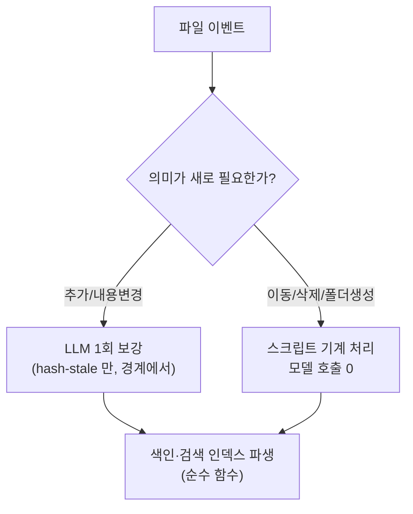

# 파일 생애주기 — 무엇이 언제, 누구에 의해 처리되는가

> 지식베이스에서 파일이 추가·변경·이동·삭제될 때 시스템이 어떻게 반응하는지의 케이스 매트릭스. 핵심 원칙: **의미 생성만 LLM, 나머지 전부 스크립트** — 그래서 드리프트가 원리적으로 발생하지 않는다.

## 언제 도는가 — 워처가 아니라 경계(boundary)

파일 변경을 실시간 감시하는 상주 데몬은 없다. 대신 잘 정의된 경계에서 `vault sync` 가 돌고, content-hash 가 "무엇이 바뀌었는지"를 결정한다:

| 경계 | 시점 | 기본 동작 |
|---|---|---|
| ingest 직후 | 도구를 통한 문서 유입 시 인라인 | 색인 재생성 |
| git pre-commit hook | 커밋 시도마다 | `--check` 드리프트 게이트 (추적 파생물이 어긋나면 커밋 차단, `.fts/` 캐시는 자가 재빌드) |
| cron 안전망 | 주기 실행 (선택, 기본 off) | write sync |
| 수동/에이전트 | `vault sync [--enrich]` | 전체 파이프라인 |

변경 후 다음 경계까지는 파생물이 잠시 뒤처질 수 있지만, `--check` 가 그 상태를 항상 탐지하므로 **어긋난 채로 조용히 지나가는 일이 없다.** 탐지 후의 처방은 파생물이 어디 사느냐로 갈린다 — 커밋 안에 있는 추적 파생물(README 색인·사이드카)은 커밋을 막고, 커밋 밖에 있는 캐시(`.fts/`)는 그 자리에서 재빌드한다. 캐시가 낡았다는 건 커밋이 틀렸다는 뜻이 아니라서, 막으면 남의 세션 편집이 내 커밋을 막는 결과만 나온다.

## 케이스 매트릭스

| 케이스 | 처리 주체 | 무슨 일이 일어나나 |
|---|---|---|
| **문서 추가** | 스크립트 + LLM(1회) | 다음 sync 에서 폴더 README 색인에 등재. `--enrich` 시 description·tags·aliases 가 빈 새 문서만 골라 설정된 provider(Claude/Codex)가 **한 번의 호출로 세 칸을 함께 생성** → frontmatter 에 기록 → description 은 색인·검색으로, tags·aliases 는 검색으로 파생. 칸별 hash 스탬프가 찍히므로 재실행해도 재호출 없음. |
| **문서 내용 변경** | 스크립트 + LLM(1회) | 본문 hash 가 그 칸의 스탬프와 어긋남(hash-stale)을 감지 → `--enrich` 시 그 문서만 재보강. 사람이 직접 쓴 값(스탬프 없는 description·tags·aliases)은 **칸별로 절대 덮어쓰지 않음**. 이미 description 스탬프가 있는 문서에 tags·aliases 만 채우는 증분 보강은 description 을 재생성하지 않음. |
| **문서 이동** | **스크립트만** | description·tags·aliases 는 frontmatter 라 파일과 함께 이동. 다음 sync 가 옛 폴더 색인에서 제거 + 새 폴더 색인에 등재. **모델 호출 0** — 이미 있는 의미를 옮기는 데 LLM 이 필요 없다. |
| **문서 삭제** | **스크립트만** | 색인 라인 제거 + 검색 인덱스 반영. 모델 호출 0. |
| **폴더 생성** | **스크립트만** | 문서가 든 새 폴더에 README 자동 생성(mint) + 부모 색인에 등재. 자식 생성이 부모 색인에 파급되는 연쇄는 fixed-point 루프가 한 번의 sync 안에서 수렴시킴. |
| **바이너리 추가/변경** (PDF 등) | 스크립트 + 추출기 | sha256 이 바뀐 것만 사이드카(`<파일>.pdf.md`) 재추출. 사이드카는 일반 문서처럼 색인·검색에 잡힘. |
| **바이너리 삭제** | 스크립트 (보고만) | 남은 사이드카는 **자동 삭제하지 않고 orphan 으로 명시 리포트** — 파생물이라도 무언 삭제는 하지 않는다는 원칙. 정리는 사람이 결정. |
| **모델 호출 실패** | 명시 리포트 | 해당 파일 미접촉 + per-file 실패 목록. 조용한 대체 경로 없음. |

## 왜 드리프트가 안 생기나

1. **파생물에는 writer 가 스크립트 하나뿐** — LLM 도 사람도 색인·인덱스를 직접 만지지 않는다. 두 writer 가 없으면 어긋날 두 진실도 없다.
2. **의미(description·tags·aliases)는 파일 안에 산다** — 문서와 그 검색 메타데이터가 한 몸이라 이동·삭제에서 분리될 수 없다.
3. **hash 가 결정한다** — "바뀌었나"의 판단이 기억이나 타임스탬프가 아니라 내용 해시라, 몇 번을 다시 돌려도 같은 결론(멱등).
4. **어긋남은 게이트가 잡는다** — `--check` 가 커밋 경계에서 추적 파생물의 드리프트를 차단한다. 커밋 밖 캐시(`.fts/`)는 같은 경계에서 원천으로부터 즉시 재생성(self-heal)되고, 그 사실이 로그로 드러난다.

## Related

- [architecture.md](architecture.md) — 전체 아키텍처와 불변식
- [setup.md](setup.md) — provider(Claude/Codex) 선택과 설치
